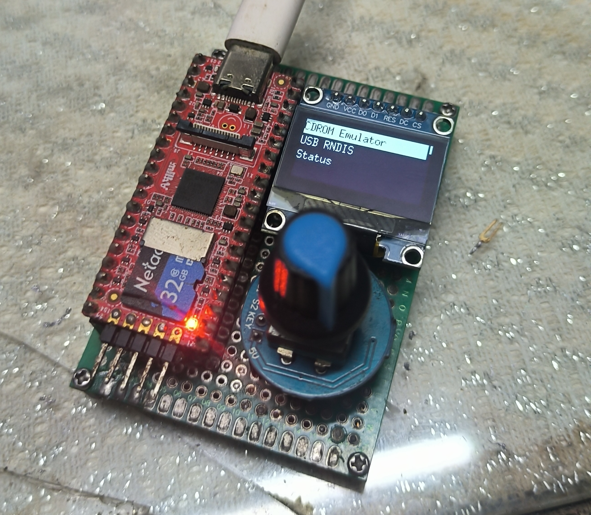

# DiscEmu

A CD-ROM drive emulator based on Linux USB Gadget, on the Milk-V Duo (Original CV1800B variant) board.

Currently at prototype stage.



## Hardware info

- Milk-V Duo board
- SSD1306 SPI 128x64 OLED
- EC11 rotary encoder

Pinout: 

|Function | Pin# |
|---------|------|
|OLED MOSI| 10   |
|OLED SCK | 9    |
|OLED RES | 22   |
|OLED DC  | 21   |
|EC11 S1  | 20   |
|EC11 S2  | 19   |
|EC11 KEY | 18   |

## Build

You can build this with the official SDK.

This app depends on the libu8g2arm library, please use [my fork](https://github.com/driver1998/libu8g2arm-milkvduo) with Milk-V Duo GPIO pin number mapping. (GPIO pin number of Duo in Linux userspace are three digits, which break assumptions in libu8g2arm. A lookup table which maps Linux pin number to actual physical pin number is added as a workaround.) 

## Usage

- This app is statically linked by default, and should run fine on Milk-V Duo official images. 

- `run_usb.sh` in this repo is modified from the official image, with CD-ROM support added, please use this verison with DiscEmu instead of the stock one.

- Place `disc-emu` and `run_usb.sh` at `/mnt/data`, and make it start at boot up by creating `/mnt/data/auto.sh`

```bash
OLD_PWD=$PWD
cd /mnt/data
nohup ./disc-emu
cd $OLD_PWD
```

- Disable RNDIS at boot up by removing `/mnt/system/usb.sh` to avoid conflicts. You can start RNDIS at the main menu of DiscEmu.

- DiscEmu looks for ISO images at `isos` in the working directory, so `/mnt/data/isos` as configured above. You might want to mount a partition with large enough space to this directory.

- Due to Linux kernel limitations, DVD images are not fully supported. Also there is a ~2.2GiB file size limit, there is a third-party patch to bypass this, see https://lkml.org/lkml/2015/3/7/388 for more details. \
You can use my fork of the official buildroot image for DVD images, it also includes some kernel patches that improves compability:  https://github.com/driver1998/duo-buildroot-sdk/releases/tag/v0.1-discemu.

